```mermaid
graph TD
  %% User Node
    User["👨â€ðŸ’» pseudonano (GitHub User)"]

    %% Main Activities
    User -->|Manages| Repos[📂 Repositories]
    User -->|Collaborates| PullRequests[🔃 Pull Requests]
    User -->|Explores| Stars[â­ Starred Projects]
    User -->|Creates| Issues[🞠Issues & Bugs]

    %% Repositories Workflow
    Repos --> RepoStatus{"Active or Archived?"}
    RepoStatus -->|Active| ActiveRepos["Active Projects"]
    RepoStatus -->|Archived| ArchivedRepos["Archived Projects"]
    ActiveRepos --> CodePush[âš™ï¸ Push Code]
    ActiveRepos --> CI_CD[🚀 CI/CD Pipelines]
    CodePush --> CI_CD
    CI_CD --> Deployed[🌠Deployed Applications]

    %% Pull Requests Workflow
    PullRequests --> ReviewPRs["Review & Merge"]
    ReviewPRs --> Contribute[🎉 Contribute to Open Source]

    %% Stars and Exploration
    Stars --> Explore[🔠Discover New Projects]
    Explore --> Fork[🴠Fork & Experiment]

    %% Issues Workflow
    Issues --> TrackBugs["Track & Resolve Bugs"]
    Issues --> FeatureRequests["Request New Features"]
```

```stl
   %% Styling
    classDef userStyle fill:#24292e,stroke:#0366d6,color:#ffffff,stroke-width:2px;
    classDef nodeStyle fill:#f6f8fa,stroke:#d1d5da,color:#000000,stroke-width:1px;
    classDef decisionStyle fill:#ffffff,stroke:#f39c12,color:#000000,stroke-width:2px,shape:diamond;

    class User userStyle;
    class Repos,PullRequests,Stars,Issues,ActiveRepos,ArchivedRepos,CodePush,CI_CD,Deployed,ReviewPRs,Contribute,Explore,Fork,TrackBugs,FeatureRequests nodeStyle;
    class RepoStatus decisionStyle;
